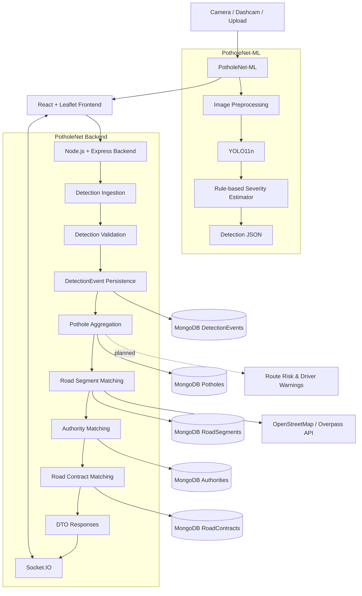
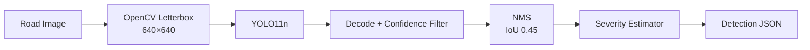

# 🚧 PotholeNet

### Real-Time Road Intelligence & Civic Infrastructure Platform

PotholeNet is a road-intelligence platform that combines **computer vision, geospatial mapping, real-time systems, and infrastructure data** to detect potholes, track their evolution, map them to road networks, identify responsible authorities, and connect road hazards with public road contracts.

> **Status:** 🚧 Active Development  
> **Current intelligence pipeline:** Detection → Pothole Intelligence → Road Segments → OSM Mapping → Authority Mapping → Road Contracts → Route Risk

---

## 📌 Overview

Traditional pothole systems primarily answer:

> **Where is the pothole?**

PotholeNet is designed to answer a broader set of questions:

> **What is happening to the road, how serious is it, which road segment is affected, who is likely responsible, and is there an active infrastructure contract associated with it?**

The platform is organized into two major layers:

1. **PotholeNet application platform**
   - React + Leaflet frontend
   - Node.js + Express backend
   - MongoDB persistence
   - Socket.IO real-time events
   - Pothole aggregation and lifecycle management
   - Road, authority, and contract intelligence

2. **PotholeNet-ML**
   - YOLO11n pothole detector
   - Dataset preparation and validation pipeline
   - Real-world regression testing
   - Rule-based severity estimation
   - PyTorch local inference
   - Torch-free Runtime production inference
   - FastAPI microservice deployed on Render

The ML service is intentionally separated from the main backend. The application backend remains the system boundary for ingestion, persistence, enrichment, and real-time delivery.

---

## 🧠 Intelligence Pipeline

```text
Camera / Dashcam / Upload
            │
            ▼
    Computer Vision Detection
            │
            ▼
       DetectionEvent
            │
            ▼
    Pothole Aggregation
            │
            ▼
      RoadSegment + OSM
            │
            ▼
    Authority / Jurisdiction
            │
            ▼
     Road Contract / Tender
            │
            ▼
   Route Risk & Road Intelligence
```

---

## ✨ Core Capabilities

### 🔴 Pothole Detection

- YOLO11n-based computer vision detection
- Detection event persistence
- ML confidence
- Rule-based severity estimation
- Estimated depth and area fields where applicable
- Geographic coordinates
- Detection history

### 📍 Geospatial Intelligence

- GeoJSON support
- MongoDB `2dsphere` indexes
- OpenStreetMap integration
- OSM road matching
- Road-segment queries
- Geographic viewport filtering

### 📈 Pothole Intelligence

- Detection aggregation
- Pothole lifecycle/status
- Historical detection timeline
- Deterioration analysis
- Severity/depth/area trends

### 🏛️ Authority Intelligence

- Jurisdiction polygons
- Polygon and MultiPolygon support
- Road-segment authority mapping
- Authority matching
- Match confidence
- Source tracking

### 📑 Road Contract Intelligence

- Road contract records
- Tender metadata
- Contractor information
- Contract value and dates
- Authority/road relationships
- Source and evidence metadata
- Contract matching

### ⚡ Real-Time Infrastructure

- Socket.IO
- Persistence-first events
- Real-time pothole updates
- Extensible event architecture

---

# 🏗️ System Architecture



### Request boundary

The intended production boundary is:

```text
Frontend
   │
   ▼
Node.js Backend
   │
   │ HTTP / multipart
   ▼
FastAPI ML Service
   │
   ▼
YOLO11n + Severity Estimator
   │
   ▼
Detection JSON
   │
   ▼
Node.js Backend
   │
   ▼
Persistence + Intelligence + Socket.IO
   │
   ▼
Frontend
```

The frontend is not intended to call the ML service directly. This keeps application-level authentication, upload handling, model integration, and rate limiting at the backend boundary.

---

# 🤖 PotholeNet-ML

PotholeNet-ML is the computer-vision subsystem responsible for pothole detection.

It is a fine-tuned **YOLO11n** service with a decoupled rule-based severity estimator. It supports:

- `ML_BACKEND=torch` for local GPU development, training, and evaluation.
- `ML_BACKEND` for lightweight CPU deployment.

The deployed Render path uses ** Runtime without PyTorch or Ultralytics installed**.

## ML inference architecture



### Production ML path

```text
Frontend
   ↓
Node.js Backend
   ↓
POST /predict
   ↓
FastAPI on Render
   ↓
YOLO11n
   ↓
Rule-based Severity
   ↓
Detection JSON
```

---

# 🧪 ML Model Status

| Component | Status |
|---|---|
| Dataset preparation | ✅ Built |
| Dataset validation | ✅ Passing — 0 errors |
| Duplicate/leakage remediation | ✅ Completed for current merge |
| Negative/background examples | ✅ Added |
| YOLO11n experiments | ✅ 3 experiments completed |
| Real-world FP/FN review | ✅ Completed |
| export and verification | ✅ Built and deployed |
| FastAPI ML service | ✅ Deployed on Render |
| Severity estimator | ✅ Built; thresholds remain placeholders |
| YOLO11s / YOLO11m comparison | ⏳ Not yet run |
| Final test-set evaluation | ⏳ Not yet run |
| ML rate limiting | ❌ Not implemented |
| Hard inference timeout | ❌ Not enforced |
| Production Node detection-module integration | ⏳ Not yet wired |

### Deployed model

The currently documented deployed model is **YOLO11n `v2_negatives`**:

| Metric | Validation |
|---|---:|
| Precision | 0.772 |
| Recall | 0.659 |
| mAP50 | 0.754 |
| mAP50-95 | 0.491 |

These validation metrics are not treated as the only deployment criterion. Real-world regression testing was also performed.

---

# 📊 ML Experiment History

Three YOLO11n experiments used the same general recipe:

- 100 epochs
- `imgsz=640`
- batch size 8
- RTX 5060 8 GB

| Run | Dataset change | Precision | Recall | mAP50 | mAP50-95 |
|---|---|---:|---:|---:|---:|
| `v13` | Original positives only, 1,588 images | 0.767 | 0.682 | 0.771 | 0.544 |
| `v2_negatives` | +317 Attain negatives | 0.772 | 0.659 | 0.754 | 0.491 |
| `v3_patch_augmented` | +152 color-augmented patch negatives | 0.781 | 0.677 | 0.759 | 0.492 |

`v3_patch_augmented` was not deployed. Real-world regression testing exposed regressions on previously tested road-surface cases, so the project retained `v2_negatives`.

This is an important engineering principle for the project:

> **Validation metrics are necessary, but they are not sufficient to establish real-world behavior.**

---

# ⚠️ Known ML Limitation

A known false-positive pattern remains on some **light-colored desert-road patch/repair textures**.

The project documentation records:

- PyTorch inference produced a 41.07% confidence detection on the investigated UAE road image.
- The deployed export produced no detection for that case.
- The difference is not treated as a confirmed fix because PyTorch confidence drift was measured at roughly 2–5% on typical images.
- The suspected issue is a domain gap between the darker Iranian road-surface examples in the Attain negative data and visually different patch/repair surfaces.

A color/brightness augmentation experiment was attempted but caused regressions and was rolled back.

The remaining improvement direction is to collect better-matched patch/repair negatives or real field data.

---

# 🗂️ ML Dataset

## Sources

| Source | Role | License / Status |
|---|---|---|
| **RDD2022** | Pothole detection (`D40`) | ⚠️ Unconfirmed — see `DATASETS.md` |
| **Pothole-600** | Pothole detection | ❌ License not verified |
| **Attain** | Negative/background examples | ✅ CC BY 4.0 |
| **Custom Indian-road images** | Domain-specific road imagery | Own data |

The repository's `DATASETS.md` is the compliance tracker. Dataset licensing and code licensing are separate concerns.

## Dataset pipeline

```text
RDD2022
Pothole-600
Custom Images
      │
      ▼
Dataset Preparation
      │
      ▼
Deduplication
      │
      ▼
Validation
      │
      ▼
Negative / Background Injection
      │
      ▼
YOLO Dataset
      │
      ▼
Training
      │
      ▼
Evaluation
      │
      ▼
Real-world Regression Testing
```

### Preparation

```bash
python scripts/prepare_dataset.py \
  --rdd2022-images /path/to/rdd/images \
  --rdd2022-annots /path/to/rdd/annotations \
  --pothole600-images /path/to/pothole600/images \
  --pothole600-labels /path/to/pothole600/labels \
  --custom-images /path/to/custom/images \
  --custom-labels /path/to/custom/labels \
  --out datasets/potholes \
  --rdd-keep-negatives-frac 0.15
```

The preparation pipeline:

- Converts RDD2022 VOC/XML annotations to YOLO format.
- Keeps the `D40` pothole class.
- Uses class ID `0` for the single-class detector.
- Performs content-based deduplication.
- Groups sequence-derived imagery where sequence metadata is available.
- Writes source-tagged filenames.
- Can preserve a configurable fraction of RDD2022 images without pothole annotations as background examples.

### Mandatory validation

```bash
python scripts/validate_dataset.py --dataset datasets/potholes
```

The validator checks:

- Image/label pairing
- Invalid class IDs
- Malformed rows
- Out-of-bounds bounding boxes
- Empty label files
- Exact duplicates
- Cross-split near-duplicate leakage

Do not blindly delete perceptual-hash matches. Visual inspection is required because similar asphalt textures can produce false duplicate matches.

```bash
python scripts/inspect_dedupe_clusters.py \
  --dataset datasets/potholes \
  --phash-thresh 6 \
  --sample 15
```

---

# 📦 Current Dataset State

After duplicate remediation and negative-example injection, the documented split is approximately:

```text
Train: 1,075
Val:     521
Test:    308

Approximate ratio: 56 / 27 / 16
```

The project intentionally documents this as a limitation rather than presenting it as the original target 70/20/10 split.

Known dataset limitations include:

1. Train is relatively thin compared with the validation/test splits.
2. Sequence metadata is not recoverable for the original positive-image dump.
3. Source resolutions vary substantially, creating a small-object detection risk.
4. An abandoned augmented patch-negative experiment left 152 augmented files physically present in the dataset directory; these do not represent the currently deployed model's training state.
5. Validation should continue to be checked for phash-distance-0 near-duplicates.

---

# 🏋️ ML Training

The project fine-tunes pretrained YOLO weights rather than training from scratch.

```bash
python scripts/train.py \
  --model yolo11n.pt \
  --data datasets/potholes/data.yaml \
  --epochs 100 \
  --imgsz 640 \
  --batch 8 \
  --name potholenet_yolo11n_v1
```

Supported model arguments include:

```text
yolo11n.pt
yolo11s.pt
yolo11m.pt
```

For the RTX 5060 8 GB development environment, batch size 8 is documented as a safe starting point. Larger models should be tested with VRAM and latency monitoring.

Training writes reproducibility metadata alongside the model weights.

If a training run is interrupted, resume from `last.pt` only when the checkpoint exists:

```python
from ultralytics import YOLO

model = YOLO("runs/<run_name>/weights/last.pt")
model.train(resume=True)
```

Do not modify dataset files while training is running.

---

# 📈 ML Evaluation

Validation is used during iteration:

```bash
python scripts/evaluate.py \
  --weights runs/<run_name>/weights/best.pt \
  --data datasets/potholes/data.yaml \
  --split val
```

The test set is intended to be evaluated once the model and dataset decisions are finalized:

```bash
python scripts/evaluate.py \
  --weights runs/<run_name>/weights/best.pt \
  --data datasets/potholes/data.yaml \
  --split test
```

Reported metrics include:

- Precision
- Recall
- mAP50
- mAP50-95
- Average inference latency
- FPS estimate

---

# 🔍 ML Error Analysis

```bash
python scripts/compare_predictions.py \
  --weights runs/<run_name>/weights/best.pt \
  --dataset datasets/potholes \
  --split val \
  --n 25 \
  --conf 0.35
```

The tool overlays:

- Ground truth in green
- Predictions in red

It also heuristically labels possible:

- `_LIKELY_FN`
- `_LIKELY_FP`

The filename tags are only a rough box-count heuristic and must be visually inspected.

The project specifically monitors:

### Potential false positives

- Road patches
- Shadows
- Manholes
- Cracks
- Puddles
- Vehicle shadows
- Pavement markings
- Repaired asphalt

### Potential false negatives

- Small/distant potholes
- Partially occluded potholes
- Poor lighting
- Wet roads
- Unusual pothole shapes

### Error-driven loop

```text
Real / independent images
        ↓
Collect FP / FN examples
        ↓
Correct annotations or add targeted negatives
        ↓
Validate dataset
        ↓
Retrain
        ↓
Evaluate on validation
        ↓
Repeat real-world regression tests
```

The test set should remain untouched during this iteration loop.

---

# 🎚️ Severity Estimation

Severity is deliberately separated from pothole detection.

The detector answers:

> **Where is the pothole?**

The severity estimator answers:

> **How serious does it appear, as a heuristic estimate?**

It does **not** claim to measure physical depth, diameter, or volume from a single uncalibrated RGB image.

Inputs include:

- Bounding-box area as a fraction of frame area
- Number of potholes in the frame
- Vertical position in the frame as a weak proximity proxy

Example:

```json
{
  "label": "moderate",
  "score": 0.41,
  "reasons": [
    "bbox covers 2.10% of frame area",
    "positioned low in frame, likely closer to camera (+0.09)"
  ],
  "estimate_only": true,
  "caveat": "Severity is a heuristic estimate ... not a physical measurement ..."
}
```

Severity thresholds are still placeholders and have not been calibrated against field data or human severity judgments.

---

```bash
python scripts/export.py \
  --weights runs/<run_name>/weights/best.pt \
  --upload-repo Karn81/PotholeNet-YOLO11n
```

Verify:

```bash
python scripts/verify_export.py \
  --pt-weights runs/<run_name>/weights/best.pt \
  --weights runs/<run_name>/weights/best.pt \
  --image <test_image.jpg>
```

Verification compares detection count, confidence, and box coordinates using matched confidence and IoU thresholds.

Box-coordinate tolerance is relative to the box size rather than a fixed pixel threshold.

## Model hosting

Weights are hosted on:

```text
Karn81/PotholeNet-YOLO11n
```

The FastAPI service can download the configured model from Hugging Face at startup and supports a local model-path fallback.

## Render deployment

The deployment image uses:

```text
python:3.11-slim
FastAPI
Runtime
OpenCV
```

The documented Render free-tier environment is CPU-only with 0.1 vCPU.

Measured inference latency in the documented testing was approximately:

```text
1.5–5.6 seconds / image
```

This is appropriate for an asynchronous upload-and-wait workflow, but the documented ML service is not intended for true live-camera inference on the Render free tier.

---

# 🔌 FastAPI ML API

## Health

```http
GET /health
```

Example:

```json
{
  "status": "ok",
  "model_loaded": true,
  "model_version": "best",
  "load_error": null
}
```

## Prediction

```http
POST /predict
Content-Type: multipart/form-data
```

Field:

```text
file
```

Example:

```bash
curl -X POST http://localhost:8000/predict \
  -F "file=@road.jpg"
```

Example response:

```json
{
  "success": true,
  "detections": [
    {
      "class_id": 0,
      "class_name": "pothole",
      "confidence": 0.85,
      "bbox": {
        "x1": 136.1,
        "y1": 312.1,
        "x2": 1123.1,
        "y2": 750.0
      },
      "severity": {
        "label": "moderate",
        "score": 0.41,
        "reasons": [
          "bbox covers 2.10% of frame area"
        ],
        "estimate_only": true,
        "caveat": "Severity is a heuristic estimate ... not a physical measurement ..."
      }
    }
  ],
  "inference_time_ms": 131.8,
  "model_version": "best"
}
```

Uploaded files are written to temporary storage for inference and deleted afterward.

---

# ⚙️ ML Configuration

| Variable | Purpose | Default |
|---|---|---|
| `ML_BACKEND` | `torch` for local GPU or for lightweight deployment | `torch` |
| `ML_MODEL_PATH` | Local model fallback | `models/potholenet_best.pt` |
| `ML_HF_MODEL_REPO` | Hugging Face model repository | `Karn81/PotholeNet-YOLO11n` |
| `ML_HF_MODEL_FILE` | Model file within the repository | `best.pt` / `best.pt` |
| `ML_CONFIDENCE_THRESHOLD` | Minimum detection confidence | `0.35` |
| `ML_MAX_IMAGE_SIZE_MB` | Maximum upload size | `10` |
| `ML_TIMEOUT_MS` | Logged timeout threshold; not a hard cutoff | `30000` |
| `ML_ALLOWED_ORIGINS` | CORS allow-list | `http://localhost:5000` |
| `ML_LOG_LEVEL` | Logging verbosity | `INFO` |

Never commit `.env`.

---

# 🧩 Backend Modules

| Module | Description | Status |
|---|---|---|
| Detection Events | Raw computer-vision detection persistence | ✅ |
| Pothole Core | Detection aggregation and lifecycle | ✅ |
| Pothole Intelligence | History and deterioration analysis | ✅ |
| Road Segments | GeoJSON road representation | ✅ |
| OSM Mapping | Road matching using OpenStreetMap | ✅ |
| Authority Mapping | Jurisdiction/authority matching | ✅ |
| Road Contracts | Contract and tender intelligence | ✅ |
| Route Risk | Route-level hazard analysis | 🚧 Next |
| Authentication | Users and authorization | 🔜 |
| Admin Operations | Municipal operations dashboard | 🔜 |
| Data Ingestion | Government/external datasets | 🔜 |

---

# 🔄 Backend Detection Pipeline

```text
POST /api/detections
        │
        ▼
Validate Detection
        │
        ▼
Persist DetectionEvent
        │
        ▼
Find / Create Pothole
        │
        ▼
RoadSegment Matching
        │
        ▼
Authority Matching
        │
        ▼
Contract Matching
        │
        ▼
Persist Enrichment
        │
        ▼
Emit Socket.IO Events
```

External enrichment is isolated from core detection persistence.

If OSM, authority, or contract lookup fails, the original detection should not be lost.

---

# 🗺️ Geospatial Architecture

PotholeNet uses GeoJSON and MongoDB geospatial indexes.

```text
DetectionEvent
      │
      │ Point
      ▼
   Pothole
      │
      │ nearby matching
      ▼
 RoadSegment
      │
      │ jurisdiction
      ▼
 Authority
```

Road segments use:

```text
GeoJSON LineString
```

Authorities use:

```text
Polygon
MultiPolygon
```

MongoDB spatial queries use:

```text
2dsphere
```

GeoJSON coordinate ordering is:

```text
[longitude, latitude]
```

---

# 📑 Contract Intelligence

Road contracts are connected to infrastructure entities rather than treated as isolated records.

```text
Authority
    │
    ├──────────────┐
    ▼              ▼
RoadSegment     Contract
    │              │
    └──────┬───────┘
           ▼
        Pothole
```

Contract records can contain:

- Tender/reference number
- Contractor
- Contract value
- Start/end dates
- Status
- Authority
- Road segments
- Source URL
- Evidence metadata

PotholeNet does not fabricate government contract information.

When no supported match exists, the system should explicitly represent that state, for example:

```text
No matching public contract found
```

---

# 🔌 Backend API

## Health

```http
GET /health
```

## Detection Events

```http
POST /api/detections
GET  /api/detections
GET  /api/detections/:id
GET  /api/detections/nearby
POST /api/detections/:id/associate
```

## Potholes

```http
GET   /api/potholes
GET   /api/potholes/:id
GET   /api/potholes/:id/history
GET   /api/potholes/:id/trend
GET   /api/potholes/:id/intelligence
PATCH /api/potholes/:id/status
```

## Road Segments

```http
GET /api/segments
GET /api/segments/:id
GET /api/segments/:id/potholes
```

## Authorities

```http
GET  /api/authorities
GET  /api/authorities/:id
GET  /api/segments/:id/authority
POST /api/segments/:id/authority/match
```

## Contracts

```http
GET  /api/contracts
POST /api/contracts
GET  /api/contracts/:id
GET  /api/segments/:id/contracts
GET  /api/authorities/:id/contracts
```

---

# 🧠 Data Integrity

PotholeNet follows an evidence-first approach.

The system does not fabricate:

- Pothole depth
- Detection history
- Authority responsibility
- Contractor information
- Tender information
- Contract values
- Road information
- Confidence values

Missing information should remain explicit:

```text
Unknown
Not available
null
[]
```

## Estimated measurements

Estimated depth is separate from measured depth:

```text
estimatedDepthCm
```

It must never be presented as ground-truth measurement.

---

# ⚡ Real-Time Events

Socket.IO events are emitted only after successful persistence.

Current events include:

```text
detection:created
pothole:created
pothole:updated
```

This persistence-first design prevents clients from receiving events for database operations that ultimately failed.

---

# 🧪 Testing

The backend currently has automated coverage for:

- Detection events
- Pothole creation
- Pothole clustering
- Detection history
- Pothole status
- Trend analysis
- GeoJSON validation
- Road-segment matching
- OSM integration
- OSM timeout/failure handling
- Authority matching
- Contract matching
- API validation
- Failure isolation

Documented current verification:

```text
64 tests passing
```

Run:

```bash
cd backend
npm test
```

---

# 🛠️ Technology Stack

## Frontend

- React
- Leaflet
- OpenStreetMap
- Socket.IO Client

## Backend

- Node.js
- Express.js
- MongoDB
- Mongoose
- Socket.IO

## Machine Learning

- Python 3.11
- YOLO11n
- Ultralytics
- PyTorch
- OpenCV
- FastAPI
- Hugging Face Hub

## Geospatial

- GeoJSON
- MongoDB `2dsphere`
- OpenStreetMap
- Overpass API
- OSRM

## Engineering

- Modular architecture
- Controller / Service / Repository pattern
- DTO-based responses
- Centralized validation
- Centralized error handling
- Environment-based configuration
- Automated testing
- Real-time event architecture

---

# 💻 Local Development

## Clone

```bash
git clone https://github.com/KarnJadhav/PotholeNet.git
cd PotholeNet
```

## Backend

```bash
cd backend
npm install
cp .env.example .env
npm test
```

Configure MongoDB and external services in `.env`.

Start the backend using the available project script.

## ML service — local GPU development

The documented ML development environment is:

```text
Windows 11
WSL2
Ubuntu 24.04.4 LTS
Python 3.11.16
conda environment: potholenet
NVIDIA RTX 5060 8 GB
PyTorch + CUDA 12.8
Ultralytics 8.3.0
```

Create the environment:

```bash
cd ml-service
conda create -n potholenet python=3.11
conda activate potholenet
python -m pip install -r requirements.txt
```

Verify CUDA:

```bash
python -c "import torch; print(torch.__version__, torch.cuda.is_available(), torch.cuda.get_device_name(0))"
```

For deployment dependencies:

```bash
pip install -r requirements.txt
```

Run FastAPI locally:

```bash
cp .env.example .env
uvicorn app.main:app --host 0.0.0.0 --port 8000
```

---

# 📁 Repository Structure

The main application and ML subsystem are organized separately.

```text
PotholeNet/
├── frontend/
├── backend/
├── ml-service/
│   ├── app/
│   │   ├── __init__.py
│   │   ├── main.py
│   │   ├── inference.py
│   │   └── severity.py
│   │
│   ├── datasets/
│   │   └── potholes/
│   │       ├── data.yaml
│   │       ├── images/{train,val,test}/
│   │       └── labels/{train,val,test}/
│   │
│   ├── models/
│   ├── requirements.txt
│   ├── Dockerfile
│   └── scripts/
│       ├── prepare_dataset.py
│       ├── validate_dataset.py
│       ├── dataset_stats.py
│       ├── visualize_annotations.py
│       ├── add_background_images.py
│       ├── train.py
│       ├── evaluate.py
│       ├── inference.py
│       ├── compare_predictions.py
│
├── DATASETS.md
├── LICENSE.md
└── README.md
```

Generated datasets, model weights, and review artifacts are not intended to be committed to Git.

---

# 🚀 Development Roadmap

## Phase 1 — Detection Foundation

- [x] Backend architecture
- [x] MongoDB integration
- [x] DetectionEvent
- [x] Pothole aggregation
- [x] REST APIs
- [x] Socket.IO
- [x] YOLO11n ML baseline
- [x] FastAPI ML service

## Phase 2 — Pothole Intelligence

- [x] Pothole lifecycle
- [x] Status management
- [x] Detection history
- [x] Trend analysis
- [x] Pothole intelligence endpoint

## Phase 3 — Geospatial Intelligence

- [x] RoadSegment model
- [x] GeoJSON geometry
- [x] OSM integration
- [x] Road matching
- [x] Geographic queries

## Phase 4 — Civic Intelligence

- [x] Authority model
- [x] Jurisdiction mapping
- [x] Authority matching
- [x] Road contracts
- [x] Tender metadata
- [x] Contract matching

## Phase 5 — ML Improvement

- [x] Real-world FP/FN review
- [x] Background/negative examples
- [ ] Better-matched patch/repair negatives
- [ ] Clean up abandoned augmented dataset files
- [ ] Expand the training split with new non-duplicate images
- [ ] Train and compare YOLO11s / YOLO11m
- [ ] One-time final test-set evaluation
- [ ] Calibrate severity thresholds using field data

## Phase 6 — Road Safety Intelligence

- [ ] Route calculation
- [ ] Route hazard matching
- [ ] Route risk score
- [ ] Risk classification
- [ ] Highest-risk road segment
- [ ] Driver hazard warnings

## Phase 7 — Platform

- [ ] Authentication
- [ ] Role-based authorization
- [ ] Admin operations
- [ ] Municipal repair workflow
- [ ] User reporting
- [ ] Analytics

## Phase 8 — Data Intelligence

- [ ] Government tender ingestion
- [ ] External infrastructure datasets
- [ ] Historical road analytics
- [ ] Automated infrastructure insights

## Phase 9 — Production Hardening

- [ ] ML rate limiting
- [ ] Hard ML inference timeout
- [ ] Real Node.js detection-module integration
- [ ] Upload endpoint authorization
- [ ] Resolve remaining dataset license verification

---

# 📌 Engineering Principles

### Correctness over complexity

Prefer reliable systems over unnecessary abstractions.

### Real data over fake intelligence

If information is unavailable, say so.

### Evidence over assumptions

Authority responsibility and contract relationships should be backed by actual source data and evidence metadata.

### Modular architecture

Detection, potholes, geospatial mapping, authorities, contracts, ML inference, and route intelligence should remain independently maintainable.

### Failure isolation

Optional external enrichment must not destroy core detection persistence.

### Detection and severity are separate

The detector identifies potholes. Severity provides a separate heuristic estimate.

### Validate before training

Dataset validation is a required gate before training.

### Protect the test set

The test set should remain untouched during model iteration and be evaluated only after model/dataset decisions are finalized.

### Real-world regression testing matters

Aggregate validation metrics should be accompanied by tests on genuinely independent road imagery.

### Progressive intelligence

The platform progressively transforms:

```text
Detection
   ↓
Location
   ↓
Road
   ↓
Authority
   ↓
Contract
   ↓
Risk
   ↓
Action
```

---

# 🔐 License & Dataset Attribution

### Code

The project code is licensed under MIT where covered by `LICENSE.md`.

### Datasets and model weights

Dataset licensing and trained weights are **not automatically covered by the code license**.

Refer to:

```text
DATASETS.md
LICENSE.md
```

for the source-specific compliance information.

The documented Attain dataset is used under **CC BY 4.0** and requires attribution for applicable redistribution.

RDD2022 and Pothole-600 licensing remain explicitly tracked as unresolved in the project documentation and should be verified before redistribution or commercial use.

---

# 👨‍💻 Author

## Karn Jadhav

PotholeNet is an independent engineering project exploring the intersection of:

- Computer Vision
- Geospatial Systems
- Real-Time Applications
- Civic Technology
- Infrastructure Intelligence
- Backend Engineering

**Repository:** `KarnJadhav/PotholeNet`

> Building road intelligence from detection to infrastructure action.
